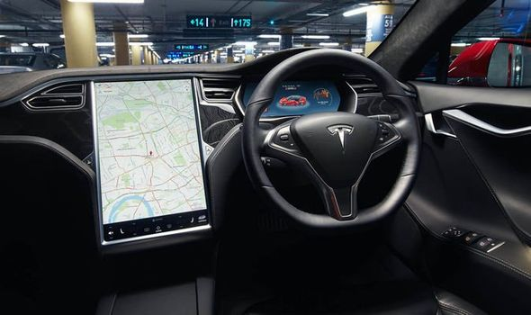
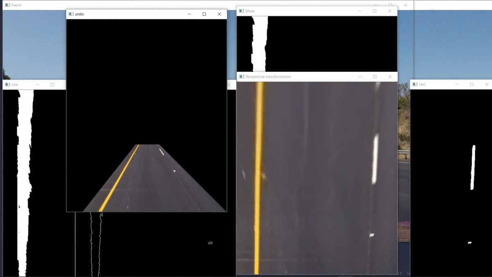

# Self Driving Car  

This project is a demonstration of a working model of self driving car 🚗🚗 identifying and following lanes using powerful computer vision 🕶🕶 algorithms.

<!-- TABLE OF CONTENTS -->
## Table of Contents

* [Description](#description-🗨🗨)
* [Idea description](#idea-discription)
* [About the Project](#about-the-project)
* [Built With](#built-with)
* [Getting Started](#getting-started)
* [Work progress](#Work-progress)
* [License](#license)
* [Support](#Support)
* [Contact](#contact)

# Description 🗨🗨

Self drining car are the cars which drive by itself without any human feedback. One of the big company that is making very best self driving car is Tesla.

Self driving cars are the future cars and the one of the top inventions for mankind. Self driving cars can save millions of lives which get wasted due to road accidents.

There are a lot of things which are been controlled by self driving cars like steering , brakes, gears and the car takes a lot of sensors (especially lidar) and camera to operate and drive on lanes and other stuffs like stop on red signal, following lanes etc.

So, i got the idea and I also want to increase my skills of computer vision, so i think to make a self driving car model with raspberri pi and camera 😃😃. 

# Idea Discription 💡💡

I want to make this project more powerful and has many features like :-
- Identify and follow lanes
- Detect cars, traffic signals , speed brakers and follow traffic signs rules
- Send that data to local machine (eg. laptop) and show it in the web browser.
- Control the car through web brower.

So from these ideas i came up with many things. It also requires powerful onborad system to make calculations real time, not to send the data to local machine and then calculate the things.

So for this , i came up with Raspberry Pi, a sigle board computer. This is the best thing for this. With it's powerful processor inbuilt with wifi, bluetooth, usb ports, it can calcute things with great ease. Other things like sterring the car by giving certain voltage to motor, or controlling LED, i handover these things to STM32, it's an arduino like microcontroller which has more input/output pins and PWM pins. 

# About The Project

This Self Driving Car 🚗 Project is build with ML 🧠 and Machine Vision 👀 

This car will capable driving itself on correct lanes, Also indentify Traffic Signals 🚦, cars, road signs and slows down around breakers 🚧 etc. and also this car is Web Intgrated to monitering the Car with web and also control with it. 

Tha camera data from the car is send through wifi to the website 🕸 to moniter the car and it's also can be controlled with web interface.

Behind scenes there ans many steps followed by the car to follow the lanes and detect the car and send the data to local machine (laptop) through wifi by raspberry pi. Some of the steps are :-

- Firstly it computed the camera calibration matrix and distortion coefficients by some chessborad images. ♟♟

- Applied a distortion correction to frame taken from the raspberry pi camera 📷

- Use many image transformation methods to create a thresholded binary image. 

- Applied a perspective transform to rectify the image (“birds-eye view”). 

- Detect the lanes and draw a line to the lanes 

- Feedback the car when the lane is bad. 👋

- Detect the car using ORB Method.

- Detect the signals using haar cascades 🚦

- And much more..

# Built With   

This project is build with ->

- Hardware 🔧 

  - RespberryPI 4 Model 
  - RespberryPI Camera
  
- Software (Programming tech) 💻

  - Core Function or ML (Python) 🐍 
    - Python
    - OpenCV
    - NumPY
    
  - Web (Node JS) 💬 
    - Node JS
    - Jonny Five

## Getting Started

Currently in development...

## Work progress

Here a lot of things going on, but in simple in the car video, the perspective transform method takes the frame in the video and rectify image simple known as  "birds-eye view" 🐦👁. Then the image is converted into a binary image (masking the image) and then the image runs through a canny edge detector to detect the edges. The masked frame is also crop in two pastes (see here that there are two frame named one (see left) and two (see right)). Currently i am working on numpy poly fit to make lines in this masked image. 

# License 

Distributed under the GNU General Public v3.0 License. See `LICENSE` for more information.

# Support 💹💲

Hey, we need an active support for our project, to add some more things like Lidar 🔦🔦 and many hardware upgrades to make this project more sucessful. Please support us if you want. You can support my send my some little money in mt paypal account :- https://www.paypal.me/shubhamai . Thanks for this, i will be very appreciated 💖💖. 

# Contact 

Feel free to contact me. I will be very appreciated to help you. 

Name - Shubham Gupta

email - shubham.aiexpert@gmail.com

Project Link: [https://github.com/Shubham2004-AI/self-driving-car](https://github.com/Shubham2004-AI/self-driving-car)

Github page link : [https://shubham2004-ai.github.io/self-driving-car/](https://shubham2004-ai.github.io/self-driving-car/)
